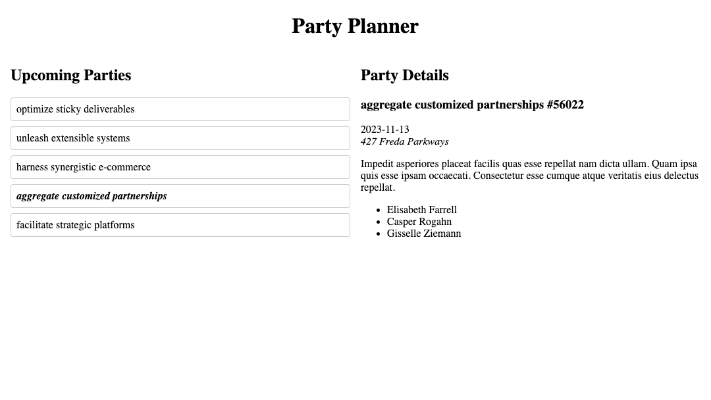

# Party Planner

The [Fullstack Convention Center](https://fsa-crud-2aa9294fe819.herokuapp.com/api) hosts a variety of events, from small meetings to large galas. Build a web application so visitors can get the latest information on upcoming events.

Read the [API documentation](https://fsa-crud-2aa9294fe819.herokuapp.com/api/#tag/Events). You will be working mainly with the `/events` endpoints.

## Requirements

For this workshop, you'll be starting from scratch! You are highly encouraged to reference previous solutions. Write JS to build an application that meets the following requirements:

- `index.html` is not modified. All elements are generated via JS.
- The application updates state by fetching an array of parties from the API.
- The application renders a list of party names.
- When a party name is clicked on, the application updates state by fetching information about a single party from the API.
- The application renders the name, ID, date, description, and location of the selected party.
- The application renders a message telling users to select a party if none is selected.
- Functions are used to organize logic involving state changes.
- The application is rerendered whenever state changes.
- UI elements are organized into component functions.
- All thrown errors are explicitly caught with a try...catch statement.

## Extensions

If you're done early, try to implement one or more of the following features:

- The name of a selected party in the party list is styled differently.
- The user can also see the guests who have RSVP'd to the selected party. This will involve fetching data from the `/rsvps` and `/guests` endpoints! Fetch all the guests first, and then use the RSVPs to filter the guests for the selected party.

## Submission

Please submit the link to your public GitHub repository.
